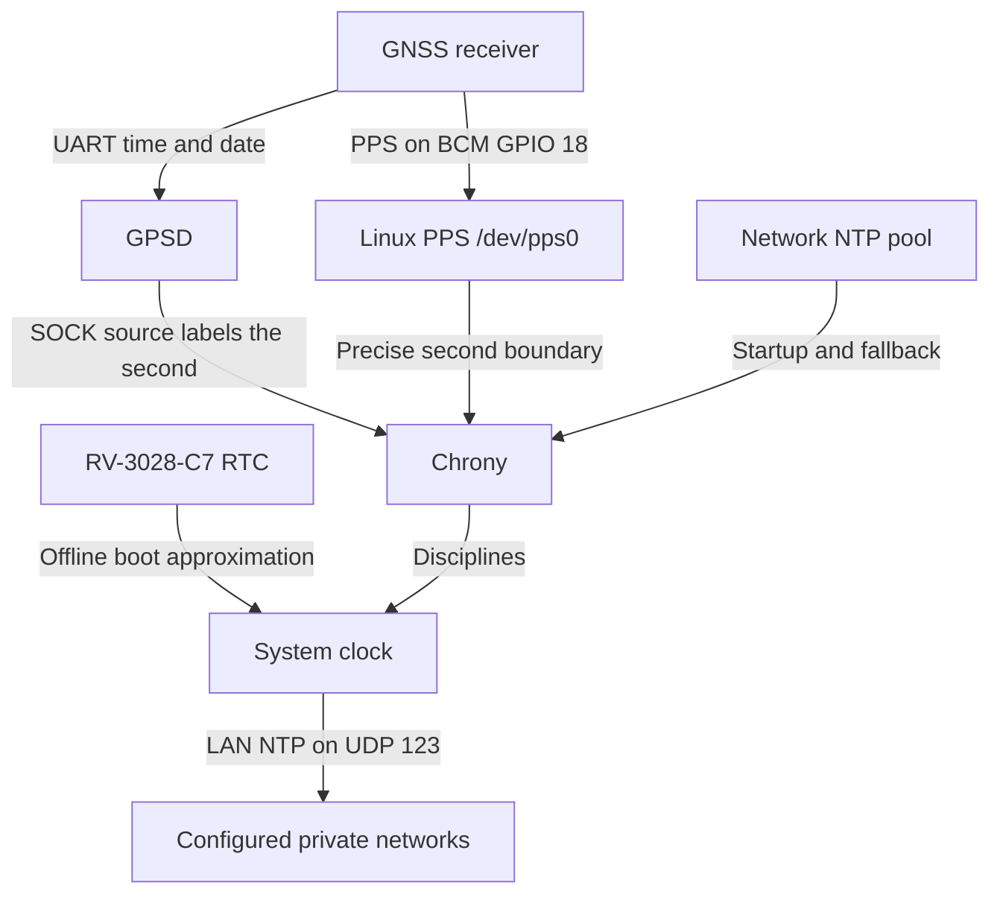

# PPSPi

[](https://github.com/Bazsy/PPSPi/actions/workflows/lint.yml)
[](https://github.com/Bazsy/PPSPi/actions/workflows/test.yml)
[](LICENSE)

PPSPi turns Raspberry Pi OS Lite into a dedicated, GPS- and
PPS-synchronised Stratum-1 NTP server. It combines GNSS time-of-day data,
kernel-timestamped pulse-per-second events, Chrony, and the HAT's hardware RTC
while staying close to the standard Raspberry Pi OS appliance model.

> [!IMPORTANT]
> PPSPi is early-stage software. Version 0.1.0 is source-verified and
> hardware-tested on the documented Raspberry Pi 4 and Uputronics Rev 6.4
> target, including a 24-hour open-sky observation and public-image smoke boot.
> Check 15 has an explicit deployment-scope waiver rather than a measured pass.
> Do not use PPSPi as a sole production time source.

## Start here

- **Building the supported appliance?** Follow the
  [five-minute quick start](docs/quick-start.md). The normal release path needs
  only one small Imager manifest download.
- **Already running PPSPi?** Use [verification](#verify-the-server) or
  [troubleshooting](docs/troubleshooting.md).
- **Have different Pi or GNSS hardware?** See the
  [hardware support levels](docs/hardware-support-tiers.md) and choose one
  focused issue from the [roadmap](docs/roadmap.md).
- **Developing PPSPi?** Start with [CONTRIBUTING.md](CONTRIBUTING.md).

## Supported hardware

| Support level | Raspberry Pi | GNSS/PPS hardware | Status |
| --- | --- | --- | --- |
| Release-tested | Raspberry Pi 4 Model B Rev 1.5 | Uputronics GPS/RTC Expansion Board Rev 6.4 using the V6.0+ profile | Available in v0.1.0 |
| Planned | Pi 3 B/B+, CM4, Pi 5 Model B | Exact products named in roadmap issues | Not yet supported; contributors needed |

CI verifies that the Pi 4 model policy is accepted and that Pi 3, Pi 5, Pi 400,
and Zero models are rejected. This is configuration testing, **not hardware
emulation**. The current installer accepts only the release-tested combination;
planned hardware has not yet earned Experimental status and is not a drop-in
substitute. See
[hardware details](docs/hardware.md) and
[support levels](docs/hardware-support-tiers.md).

## How time reaches your network



PPS is precise but cannot identify which second it marks. GPS serial data
provides that label but has variable delivery latency. Chrony locks the PPS
source to the GPS source, selecting PPS for precision and retaining network NTP
for startup and GNSS outages. The RTC is only an offline boot aid.

## Download and flash an image

For the normal beginner path, open the
[latest release](https://github.com/Bazsy/PPSPi/releases/latest), expand
**Assets**, and download only:

`ppspi-<version>-raspios-trixie-arm64.rpi-imager-manifest`

Use current Raspberry Pi Imager 2.x and open the `.rpi-imager-manifest` file,
not the image's **Use custom** path. The manifest identifies Raspberry Pi 4 Model
B as the only supported target in PPSPi's Imager metadata, enables customisation
through `cloudinit-rpi`, and supplies versioned image URLs, sizes, and SHA-256
values. The installed PPSPi model policy remains the runtime compatibility guard.
Then:

1. choose a hostname and create the initial user;
2. set locale and timezone;
3. enable SSH only if needed;
4. use a strong, unique password on a trusted private LAN, or configure a
  public key if preferred;
5. leave Wi-Fi unset for the initial wired-Ethernet target.

PPSPi ships no default password, SSH key, Wi-Fi credential, or enabled SSH
service. The separate image, checksum, and build-info assets remain available
for offline flashing and independent verification; beginners do not need to
download them. See the [quick start](docs/quick-start.md) or
[Raspberry Pi Imager guide](docs/raspberry-pi-imager.md).

## Install on an existing Raspberry Pi OS Lite system

On a clean Trixie 64-bit installation:

```console
git clone https://github.com/Bazsy/PPSPi.git
cd PPSPi
sudo ./scripts/install.sh
sudo reboot
```

The installer is idempotent, validates the Pi model and profile, preserves
unrelated boot settings, and backs up changed boot files. By default, Chrony
serves every standard private LAN range:

- `10.0.0.0/8`;
- `172.16.0.0/12`;
- `192.168.0.0/16`;
- `fc00::/7` (IPv6 Unique Local Addresses).

This includes `192.168.1.0/24`. User-configured public, loopback, link-local,
CGNAT, multicast, and documentation/test ranges are not accepted. PPSPi renders
only the exact IPv4/IPv6 loopback host routes needed by its local NTP health
query. You can optionally narrow access to the subnet or subnets actually routed
to the Pi:

```console
sudo ppstime-config set NTP_ALLOW 192.168.1.0/24
sudo ppstime-config apply
```

See the [installation guide](docs/installation.md) for profile overrides,
dry-run behavior, backup locations, and recovery instructions.

## Verify the server

After reboot, allow the antenna time to obtain a fix outdoors. A first cold fix
can take several minutes.

```console
ppstime-status
ppstime-status --json
sudo ppstime-test
chronyc tracking
chronyc sources -v
sudo ppstest /dev/pps0
gpspipe -w -n 10
```

A healthy settled system should show `PPS` selected, Stratum 1, active pulses,
and a normal Chrony leap status. Lack of satellite lock during image build is
not an error; lack of a fix on deployed hardware is a diagnostic condition.

From a Linux client with `ntpsec-ntpdate` installed:

```console
ntpdate -q ppspi
```

The client's address must fall inside `NTP_ALLOW`, and UDP port 123 must be
reachable on the LAN.

## Configuration and diagnostics

The active configuration is `/etc/ppstime/ppstime.env`. Use the validated tool
instead of editing generated Chrony or GPSD files directly:

```console
sudo ppstime-config show
sudo ppstime-config set GPS_DEVICE /dev/ttyAMA0
sudo ppstime-config apply
```

Generate a support bundle with:

```console
sudo ppstime-diagnostics --output-dir /tmp
```

The current `0.2.0-dev` branch adds `ppstime-backup`; it is not included in the
published v0.1.0 image. On `0.2.0-dev`, create a portable mode-`0600` PPSPi
configuration backup with:

```console
ppstime-backup export --output "$HOME/ppstime-backup.tar.gz"
```

It excludes accounts, SSH keys, Wi-Fi credentials, and unrelated OS files.
See [configuration backup and disaster recovery](docs/backup-restore.md).

`ppstime-health` and the passive stateful monitor are available on the current
`0.2.0-dev` development branch; they are not included in the published v0.1.0
image. On a `0.2.0-dev` installation, inspect confirmed appliance health and
transition state with:

```console
ppstime-health
ppstime-health --json
```

The passive monitor requires two consecutive observations before changing
timing or host state, never remediates, restarts, or reboots, and can emit
Prometheus textfile metrics or invoke guarded local transition hooks. Inspect
storage, temperature, throttling, filesystem errors, and update freshness with
`ppstime-host-health`. See [health monitoring and soak testing](docs/monitoring.md)
and [host health monitoring](docs/host-health.md).

Bundles contain only PPSPi-related status, logs, device information, and a
sanitised configuration. They exclude SSH material, password databases,
network credentials, and unrelated logs. Review every archive before sharing.

## Build and test from source

Static tests require only Python 3.10 or newer:

```console
make test
```

Image builds require Git, Docker, substantial free disk space, and an arm64
capable pi-gen Docker/QEMU environment:

```console
./scripts/build-image.sh
```

The build pins official pi-gen commit
`ca8aeed0ae300c2a89f55ce9617d5f96a27e99e5` and packages XZ, SHA-256, and JSON
metadata artifacts. Published releases also include an Imager manifest. See
[development](docs/development.md) and
[image architecture](pi-gen/README.md).

## Release controls

- Pull requests and merges run lint and static tests only.
- Test images build only through the manually dispatched **Build test image**
  workflow.
- A release build runs only after a maintainer explicitly publishes a GitHub
  Release whose `v<version>` tag matches the committed `VERSION` file.
- The release workflow uses GitHub's scoped `GITHUB_TOKEN`; no personal access
  token is required.
- Repository environment protection can require approval for the `release`
  environment.

See the [release process](docs/release-process.md) for the exact gates.

## Security defaults

- no default password or project SSH key;
- SSH disabled until the owner enables it through Imager;
- password SSH accepted for a trusted private LAN, provided the password is
  strong and unique and TCP port 22 is not exposed publicly;
- no web or administrative API;
- NTP allowed by default from all RFC 1918 IPv4 and RFC 4193 IPv6 ULA ranges;
- public, loopback, link-local, CGNAT, multicast, and test ranges rejected;
- generated configuration uses least-privilege file modes;
- diagnostics are scoped and sanitised;
- standard Raspberry Pi OS package signing and updates remain intact.

Report vulnerabilities according to [SECURITY.md](SECURITY.md).

## Known limitations

- Older Uputronics board revisions may use a different RTC and are not assumed
  compatible without identification.
- Only Raspberry Pi 4 Model B is accepted by the initial profile.
- Continuous Stratum-1 operation requires a stable, broad sky view. A modern
  low-E window or obstructed forest view can show many satellites while yielding
  too few usable signals for a reliable fix/PPS output.
- The broad private-LAN default can be narrowed when the routed client subnets
  are known.
- GPS serial latency correction defaults to zero and requires measurement before
  tuning; GPS is therefore marked `noselect` and used to label PPS.
- Generic UART/PPS hardware and other Raspberry Pi models are deferred.
  Contributor-sized validation issues are listed in the
  [roadmap](docs/roadmap.md).

## Documentation

- [Five-minute quick start](docs/quick-start.md)
- [Roadmap](docs/roadmap.md)
- [Installation](docs/installation.md)
- [Raspberry Pi Imager](docs/raspberry-pi-imager.md)
- [Hardware](docs/hardware.md)
- [Hardware support levels](docs/hardware-support-tiers.md)
- [Architecture](docs/architecture.md)
- [Chrony design](docs/chrony.md)
- [Diagnostics](docs/diagnostics.md)
- [Health monitoring and soak testing](docs/monitoring.md)
- [Host health monitoring](docs/host-health.md)
- [Configuration backup and disaster recovery](docs/backup-restore.md)
- [Troubleshooting](docs/troubleshooting.md)
- [Hardware acceptance plan](docs/hardware-test-plan.md)
- [v0.1.0 hardware report](docs/hardware-test-report-v0.1.0.md)
- [v0.1.0 release readiness](docs/release-readiness-v0.1.0.md)
- [v0.1.0 release notes](docs/release-notes-v0.1.0.md)
- [Development](docs/development.md)
- [Release process](docs/release-process.md)

PPSPi is released under the [MIT License](LICENSE).
