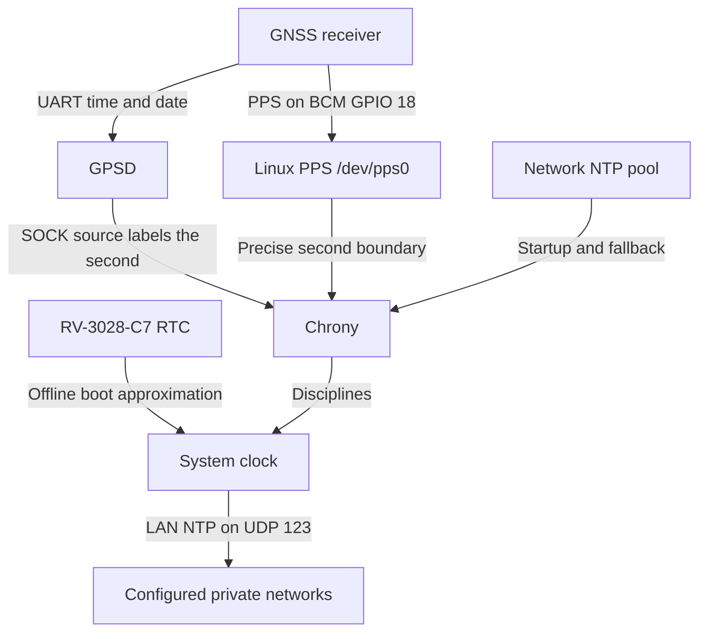

# PPSPi

[](https://github.com/Bazsy/PPSPi/actions/workflows/lint.yml)
[](https://github.com/Bazsy/PPSPi/actions/workflows/test.yml)
[](LICENSE)

PPSPi turns Raspberry Pi OS Lite into a dedicated, GPS- and
PPS-synchronised Stratum-1 NTP server. It combines GNSS time-of-day data,
kernel-timestamped pulse-per-second events, Chrony, and the HAT's hardware RTC
while staying close to the standard Raspberry Pi OS appliance model.

> [!IMPORTANT]
> PPSPi is pre-release software. The configuration is source-verified for the
> Uputronics GPS/RTC Expansion Board V6.0+, but the complete Raspberry Pi 4
> hardware acceptance plan has not yet been executed. Do not use it as a sole
> production time source until a release includes a completed hardware report.

## Supported hardware

The first milestone deliberately supports one tested target:

- Raspberry Pi 4 Model B;
- Uputronics GPS/RTC Expansion Board V6.0+ with RV-3028-C7 RTC;
- active GNSS antenna with a clear view of the sky;
- wired Ethernet;
- Raspberry Pi OS Lite 64-bit Trixie.

CI verifies that the Pi 4 model policy is accepted and that Pi 3, Pi 5, Pi 400,
and Zero models are rejected. This is configuration testing, **not hardware
emulation**. See [hardware details and revision caveats](docs/hardware.md).

## How time reaches your network



PPS is precise but cannot identify which second it marks. GPS serial data
provides that label but has variable delivery latency. Chrony locks the PPS
source to the GPS source, selecting PPS for precision and retaining network NTP
for startup and GNSS outages. The RTC is only an offline boot aid.

## Download and flash an image

When hardware-tested images are available, download these files from
[GitHub Releases](https://github.com/Bazsy/PPSPi/releases):

- `ppspi-<version>-raspios-trixie-arm64.img.xz`;
- the matching `.sha256` file;
- `build-info.json`.

Verify the image before flashing:

```console
sha256sum --check ppspi-<version>-raspios-trixie-arm64.img.xz.sha256
```

Use Raspberry Pi Imager's **Use custom** option to select the compressed image.
In Imager customisation:

1. choose a hostname and create the initial user;
2. set locale and timezone;
3. enable SSH only if needed;
4. prefer public-key authentication;
5. leave Wi-Fi unset for the initial wired-Ethernet target.

PPSPi ships no default password, SSH key, Wi-Fi credential, or enabled SSH
service. It retains the standard Raspberry Pi OS first-boot mechanisms.

## Install on an existing Raspberry Pi OS Lite system

On a clean Trixie 64-bit installation:

```console
git clone https://github.com/Bazsy/PPSPi.git
cd PPSPi
sudo ./scripts/install.sh
sudo reboot
```

The installer is idempotent, validates the Pi model and profile, preserves
unrelated boot settings, and backs up changed boot files. By default, Chrony
serves every standard private LAN range:

- `10.0.0.0/8`;
- `172.16.0.0/12`;
- `192.168.0.0/16`;
- `fc00::/7` (IPv6 Unique Local Addresses).

This includes `192.168.1.0/24`. Public, loopback, link-local, CGNAT, multicast,
and documentation/test ranges are not accepted. You can optionally narrow
access to the subnet or subnets actually routed to the Pi:

```console
sudo ppstime-config set NTP_ALLOW 192.168.1.0/24
sudo ppstime-config apply
```

See the [installation guide](docs/installation.md) for profile overrides,
dry-run behavior, backup locations, and recovery instructions.

## Verify the server

After reboot, allow the antenna time to obtain a fix outdoors. A first cold fix
can take several minutes.

```console
ppstime-status
ppstime-status --json
sudo ppstime-test
chronyc tracking
chronyc sources -v
sudo ppstest /dev/pps0
gpspipe -w -n 10
```

A healthy settled system should show `PPS` selected, Stratum 1, active pulses,
and a normal Chrony leap status. Lack of satellite lock during image build is
not an error; lack of a fix on deployed hardware is a diagnostic condition.

From a Linux client with `ntpsec-ntpdate` installed:

```console
ntpdate -q ppspi
```

The client's address must fall inside `NTP_ALLOW`, and UDP port 123 must be
reachable on the LAN.

## Configuration and diagnostics

The active configuration is `/etc/ppstime/ppstime.env`. Use the validated tool
instead of editing generated Chrony or GPSD files directly:

```console
sudo ppstime-config show
sudo ppstime-config set GPS_DEVICE /dev/ttyAMA0
sudo ppstime-config apply
```

Generate a support bundle with:

```console
sudo ppstime-diagnostics --output-dir /tmp
```

Bundles contain only PPSPi-related status, logs, device information, and a
sanitised configuration. They exclude SSH material, password databases,
network credentials, and unrelated logs. Review every archive before sharing.

## Build and test from source

Static tests require only Python 3.10 or newer:

```console
make test
```

Image builds require Git, Docker, substantial free disk space, and an arm64
capable pi-gen Docker/QEMU environment:

```console
./scripts/build-image.sh
```

The build pins official pi-gen commit
`ca8aeed0ae300c2a89f55ce9617d5f96a27e99e5` and packages XZ, SHA-256, and JSON
metadata artifacts. See [development](docs/development.md) and
[image architecture](pi-gen/README.md).

## Release controls

- Pull requests and merges run lint and static tests only.
- Test images build only through the manually dispatched **Build test image**
  workflow.
- A release build runs only after a maintainer explicitly publishes a GitHub
  Release whose `v<version>` tag matches the committed `VERSION` file.
- The release workflow uses GitHub's scoped `GITHUB_TOKEN`; no personal access
  token is required.
- Repository environment protection can require approval for the `release`
  environment.

See the [release process](docs/release-process.md) for the exact gates.

## Security defaults

- no default password or project SSH key;
- SSH disabled until the owner enables it through Imager;
- no web or administrative API;
- NTP allowed by default from all RFC 1918 IPv4 and RFC 4193 IPv6 ULA ranges;
- public, loopback, link-local, CGNAT, multicast, and test ranges rejected;
- generated configuration uses least-privilege file modes;
- diagnostics are scoped and sanitised;
- standard Raspberry Pi OS package signing and updates remain intact.

Report vulnerabilities according to [SECURITY.md](SECURITY.md).

## Known limitations

- Real Pi 4/Uputronics acceptance testing is still required.
- Older Uputronics board revisions may use a different RTC and are not assumed
  compatible without identification.
- Only Raspberry Pi 4 Model B is accepted by the initial profile.
- The broad private-LAN default can be narrowed when the routed client subnets
  are known.
- GPS serial latency correction defaults to zero and requires measurement before
  tuning; GPS is therefore marked `noselect` and used to label PPS.
- Generic UART/PPS hardware and other Raspberry Pi models are deferred.

## Documentation

- [Installation](docs/installation.md)
- [Hardware](docs/hardware.md)
- [Architecture](docs/architecture.md)
- [Chrony design](docs/chrony.md)
- [Diagnostics](docs/diagnostics.md)
- [Troubleshooting](docs/troubleshooting.md)
- [Hardware acceptance plan](docs/hardware-test-plan.md)
- [Development](docs/development.md)
- [Release process](docs/release-process.md)

PPSPi is released under the [MIT License](LICENSE).
