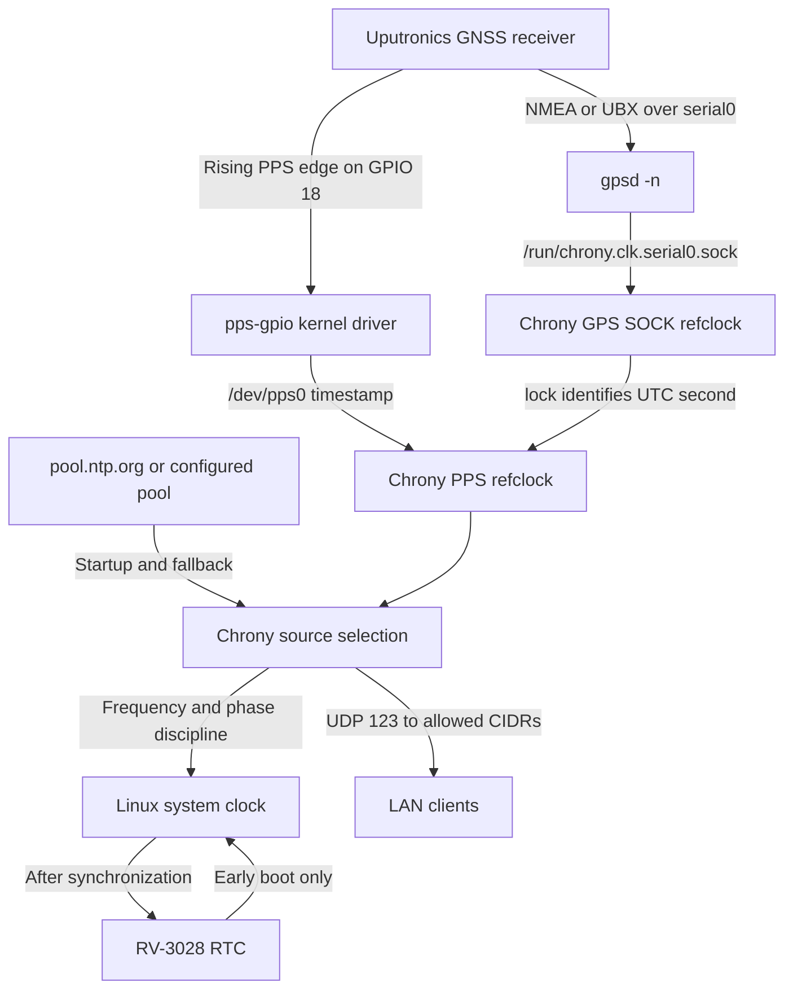
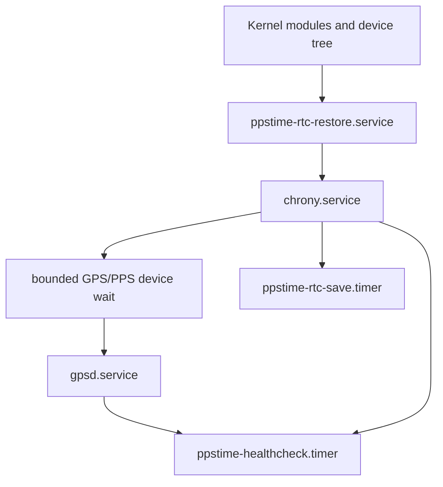

# Architecture

## Timing chain



## Why two GNSS inputs are required

The serial message contains date and time, but its arrival is delayed by GNSS
processing, UART transmission, scheduling, and GPSD. That delay varies too much
for microsecond-level phase synchronization.

The PPS edge is kernel-timestamped near the true second boundary, but a pulse
does not say which UTC second occurred. Chrony therefore receives:

- a GPS SOCK source named `GPS`, marked `noselect`, for date/second identity;
- a direct kernel PPS refclock named `PPS`, locked to `GPS`, for phase.

PPS becomes the selected Stratum-0 refclock once stable, making the server
Stratum 1. Network NTP remains present so the system can start and continue
tracking when GNSS is unavailable.

## Source-controlled configuration

The repository has one configuration path:

```text
config/default.env
        +
config/profiles/<profile>.env
        +
optional custom config
        +
recognized environment overrides
        |
        v
strict parser and validator
        |
        +--> /etc/ppstime/ppstime.env
        +--> /etc/chrony/conf.d/ppstime.conf
        +--> /etc/default/gpsd
        +--> managed boot block and cmdline
```

`scripts/install.sh` and the pi-gen custom stage both invoke this implementation.
The image build does not maintain a second set of hand-written appliance files.

## Boot configuration ownership

PPSPi detects the modern `/boot/firmware` layout first and supports the legacy
`/boot` layout. It owns only a marked block in `config.txt`. Re-rendering
replaces that block and preserves all unrelated lines. Malformed or duplicate
markers stop installation instead of risking an ambiguous edit.

`cmdline.txt` remains one line. Only serial-console tokens for `serial0`,
`ttyAMA*`, or `ttyS*` are removed; console output on `tty1`, root filesystem
arguments, and unrelated options remain.

## Service ordering and recovery



Chrony must create its GPSD SOCK socket before GPSD starts. GPSD waits up to 30
seconds for serial and PPS devices, then systemd's bounded restart policy retries
after transient failures. There are no arbitrary long startup sleeps.

The health check reports state to the journal and always exits successfully. A
normal antenna outage therefore cannot create a service restart storm. Chrony's
bounded root-distance policy ages stopped PPS naturally and selects fresh
network time without a watchdog modifying source state. The RTC save command
silently defers writes while Chrony is unsynchronized.

## Trust and failure behavior

| Failure | Expected behavior |
| --- | --- |
| No initial GNSS fix | Network NTP initializes and disciplines the clock |
| GPS serial messages but no PPS | GPS is visible but `noselect`; network remains selected |
| PPS device but no GPS label | PPS cannot lock and is rejected |
| Antenna removed after lock | Chrony falls back to network sources without restarting |
| Network unavailable with healthy GNSS | GPS/PPS continue as Stratum 1 |
| GPS and network unavailable after sync | Chrony free-runs using learned drift; RTC is not promoted |
| Cold boot with no GPS/network | RTC gives plausible boot time; system remains unsynchronized |
| RTC unavailable | Boot continues; diagnostics report the failure |

## Security boundaries

PPSPi configures a time appliance, not an identity or remote-management system.
It has no custom network daemon or web interface. Chrony's command socket stays
local, and NTP access requires explicit private CIDRs. OS account management,
SSH policy, updates, firewalling, physical security, and GNSS spoofing detection
remain external responsibilities.
