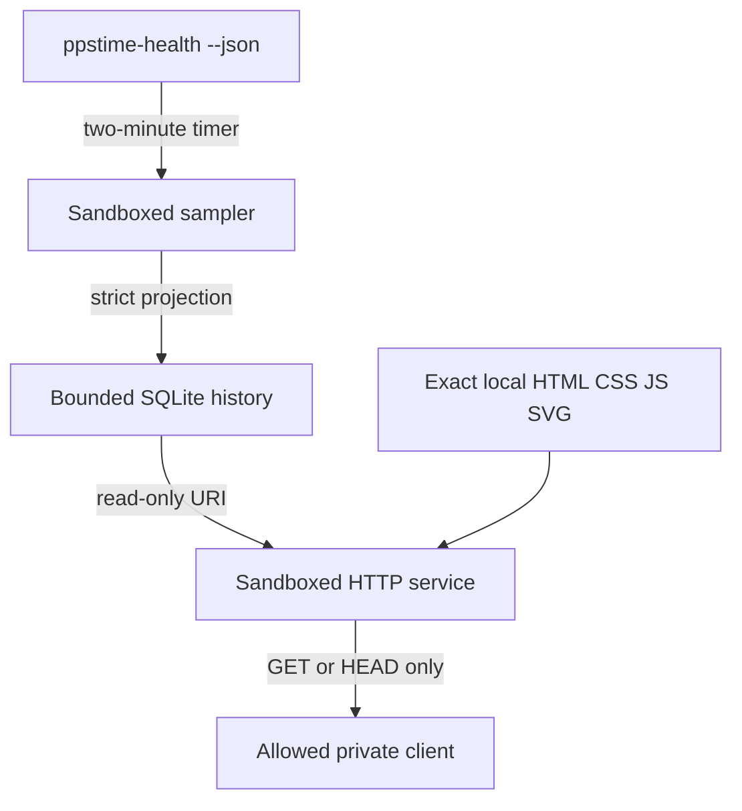

# Optional read-only dashboard

PPSPi includes a small, dependency-free dashboard for viewing sanitized timing
and host-health history from a trusted private network. It starts automatically,
binds to all IPv4 interfaces, and admits loopback and RFC 1918 clients by
default, so both Ethernet and Wi-Fi addresses work after boot without
configuration. It is not an administrative interface: there are no write
actions, login flow, command endpoints, raw diagnostic responses, or external
requests.

## Architecture

The implementation uses only the Python standard library and four fixed local
assets. It does not install Netdata, Prometheus, Grafana, a JavaScript package,
or another runtime package.

The UI is validated with deterministic sanitized fixtures, not appliance data,
at desktop and narrow mobile viewports. Screenshots attached to issue reports
must likewise use fixtures rather than appliance data.

The committed fixture scenarios cover network fallback, timing collector
unavailability, host warning/throttling, and GPS/PPS/RTC hardware error. They
ensure degraded examples use the same closed API schema without copying raw
appliance output.



The sampler and HTTP server are separate modes of `ppstime-dashboard` and run
in separate systemd units:

- `ppstime-dashboard-sample.service` is a short-lived, network-disabled process.
  It invokes only `ppstime-health --json`, validates its closed schema, discards
  raw reasons and identifying fields, and writes one projected row.
- `ppstime-dashboard.service` never invokes a command. It opens SQLite with
  `mode=ro`, serves only exact known routes through a purpose-built
  `BaseHTTPRequestHandler`, and has no writable state directory.
- `ppstime-dashboard-sample.timer` runs every two minutes with a small jitter.

## Open the dashboard

After boot, browse to port 8080 using the appliance hostname or either private
IPv4 address, for example:

```console
http://ppspi:8080
http://192.168.1.20:8080
```

No PPSPi command is needed. The server and two-minute history sampler are enabled
at installation and start automatically on later boots. `0.0.0.0` is a listen
address, not a URL; use the Pi's hostname or current Ethernet/Wi-Fi address in a
browser.

To restrict access to one private subnet while continuing to listen on both
interfaces:

```console
sudo ppstime-config set DASHBOARD_ALLOWED_CIDRS 127.0.0.1/32,192.168.1.0/24
sudo ppstime-config apply
```

`DASHBOARD_BIND` accepts the IPv4 wildcard `0.0.0.0` or one literal
loopback/private address. It does not accept hostnames, the IPv6 wildcard,
public addresses, link-local addresses, CGNAT, multicast, or documentation
ranges. Every allowed CIDR must be loopback, RFC 1918 IPv4, or RFC 4193 IPv6
ULA. The service checks the socket peer address itself; forwarded identity
headers are ignored. A wildcard bind does not bypass this peer check.

Available settings are:

| Key | Default | Bounds |
| --- | --- | --- |
| `DASHBOARD_ENABLED` | `true` | `true` or `false` |
| `DASHBOARD_BIND` | `0.0.0.0` | IPv4 wildcard or literal loopback/private address |
| `DASHBOARD_PORT` | `8080` | 1024 through 65535 |
| `DASHBOARD_ALLOWED_CIDRS` | loopback and all RFC 1918 ranges | strict private/loopback CIDRs |
| `DASHBOARD_RETENTION_HOURS` | `168` | 1 through 720 hours |

The summary cards display root and boot free space plus CPU temperature with
one decimal place. Sanitized history and API responses retain their validated
numeric precision for graphing and analysis.

Disable both the server and sampler with:

```console
sudo ppstime-config set DASHBOARD_ENABLED false
sudo ppstime-config apply
```

Disabling preserves existing history for a later re-enable. Remove
`/var/lib/ppstime-dashboard/dashboard.sqlite3` manually while both units are
stopped if history must be erased.

## Data and privacy boundary

The dashboard stores and returns only this versioned, sanitized sample shape:

- sample UTC timestamp and epoch;
- confirmed timing and host states;
- timing/host collector availability;
- coarse GPS fix, satellites used, selected source, Stratum, PPS pulse state,
  RTC availability, bounded system offset, and root dispersion;
- root and boot available percentages;
- CPU temperature and firmware throttling flags;
- bounded update status and reboot-required flag.

It does not store or return device paths, serial data, RTC timestamps, hostnames,
IP addresses, NTP client addresses, profile names, filesystem byte counts, raw
health reasons, update error text, journals, arbitrary JSON fields, or command
output. Unknown schema keys, enum values, non-finite numbers, and out-of-range
values fail closed at sampling time.

The API is only `GET` or `HEAD /api/v1/dashboard?hours=1|6|24|168|720`. Responses are
bounded and contain no raw passthrough. Static routing is limited to `/`,
`/index.html`, `/dashboard.css`, `/dashboard.js`, and `/ppspi.svg`. Other paths,
query strings on assets, traversal attempts, and unsupported ranges fail. Other
HTTP methods return `405` with `Allow: GET, HEAD`.

Every normal response includes a self-only Content Security Policy, forced
connection close, frame and
MIME protections, a no-referrer policy, same-origin isolation headers, and a
restrictive permissions policy. The process also applies per-peer token-bucket
rate limiting, a fixed concurrent-request cap, short SQLite lock waits, and
request target/header/body/asset/response size bounds. Access logging is disabled
so client addresses and query strings never enter journald.

This is plain HTTP because PPSPi does not generate or manage a local TLS
identity. Do not expose it to the internet or an untrusted network. Disable it
or restrict the allowed CIDRs when the attached network is not trusted; use a
loopback bind with an SSH tunnel when transport confidentiality is needed.

## Bounded storage and microSD writes

History is stored in `/var/lib/ppstime-dashboard/dashboard.sqlite3`. Each
writer connection enforces:

- SQLite `DELETE` journaling (WAL is disabled);
- `synchronous=FULL`;
- a 4096-byte page size and 2048-page writer cap (8 MiB);
- time retention plus a hard row cap of 30 two-minute samples per configured
  hour, with two rows of scheduling tolerance;
- incremental free-page reclamation;
- a regular-file and size check before and after writing.

The practical simplification for this release writes every two-minute sample
directly to SQLite rather than buffering an hour in tmpfs. That is approximately
720 durable transactions per day while enabled and therefore creates ongoing
microSD writes. Disable the dashboard when history is unnecessary, use a shorter
retention period when appropriate, and use endurance-rated storage for long-lived
appliances. The database remains bounded, but write endurance is a separate
physical property.

## Services, updates, and rollback

Inspect service state with:

```console
systemctl status ppstime-dashboard.service
systemctl status ppstime-dashboard-sample.timer
journalctl -u ppstime-dashboard.service
journalctl -u ppstime-dashboard-sample.service
```

The HTTP unit uses a dynamic user; the network-isolated root sampler receives
only the dashboard state directory as writable. Both use empty capability sets, strict
filesystem protection, namespace and syscall restrictions, memory/task/file
limits, and separate address-family policies. The sampler has
`PrivateNetwork=true`.

The executable, exact four assets, and three units are part of the signed
application payload and installed managed-file inventory. Application updates
validate the candidate units, snapshot dashboard files and unit state, apply the
validated configuration, and reconcile both dashboard units from
`DASHBOARD_ENABLED`. Failed updates and local rollback restore files, installed
identity, and prior unit states through the existing transactional update path.
The server watches the identities of its atomically replaced configuration and
executable; replacement makes it exit so systemd starts the installed or
restored version instead of retaining stale in-memory code or settings.
An application update migrates only the exact v0.2.0 disabled/loopback default
tuple to the current automatic private-LAN defaults. Any operator-customized
dashboard setting is preserved. The active configuration is included in the
transaction snapshot, so failed apply and local rollback restore the prior
settings and unit state.

## Diagnostics and acceptance

`ppstime-diagnostics` includes dashboard unit logs/status and
`dashboard-summary.json`. The summary contains non-identifying configuration
state plus database size, sample count, and oldest/latest timestamps; it
intentionally excludes sample rows, bind addresses, and allowed CIDRs.

Automated tests validate the fixture-driven UI data contract, privacy
projection, ranges, methods, security headers, storage bounds, automatic
private-LAN defaults, signed inventory, and unit sandbox declarations. On
supported hardware, manually verify responsive layout, keyboard range controls,
two-minute refresh, loopback access, one explicitly allowed LAN client, and
rejection from an out-of-CIDR client.
